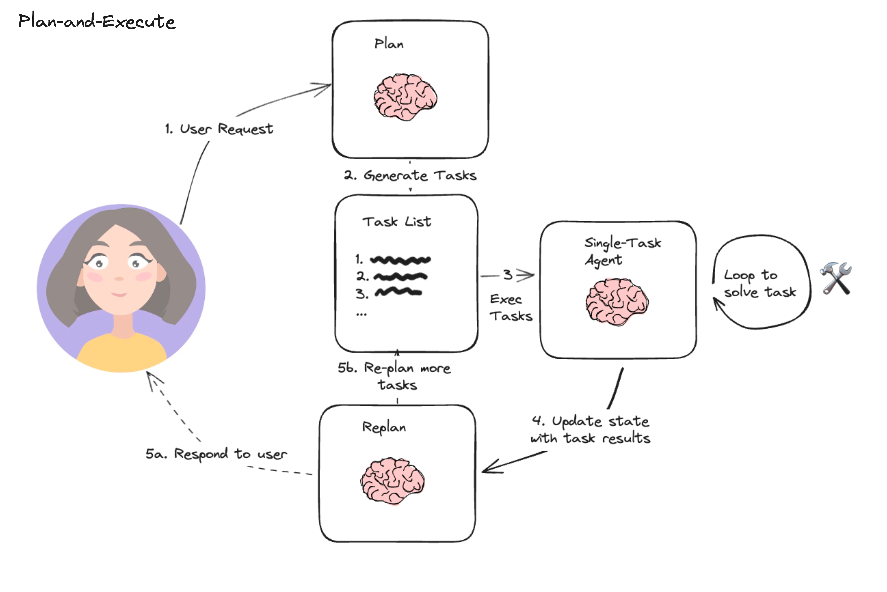

<h1 align="center">
    UACP
</h1>
<p align="center">
  🚀 Using Universal Agent Communication Protocol to Build Your Agent 🤖
</p>

## What is UACP?

UACP is an innovative API specification designed to serve as the lingua franca for communication between diverse intelligent Agents. By providing a set of standardized interfaces, UACP enables seamless integration and efficient, flexible interaction among a variety of AI Agents. The design philosophy of UACP is centered around openness, extensibility, and interoperability, ensuring that it can adapt to the evolving technological ecosystem and support use cases ranging from simple automation tasks to complex multi-Agent systems.

## Core Concept

📋**Task Management**: At the heart of UACP is the concept of task management. A task represents a discrete unit of work assigned to an agent, which could range from simple file operations to intricate decision-making processes. UACP defines a clear structure for tasks, ensuring that agents understand what is required and can report their progress and results in a consistent manner.

🔀 **Dynamic Workflow Composition**: UACP use `uacp.Step` to handle the dynamic workflow composition. Each step represents a specific action or decision point within a task, allowing agents to break down complex tasks into smaller, manageable units. This enables agents to adapt their behavior based on the current context and the results of previous steps, leading to more efficient and effective task execution.

⚡ **Real-Time Interaction**: Real-time interaction is a cornerstone of UACP. Agents can communicate in real-time, exchanging messages, status updates, and data streams. This enables synchronous operations and immediate responses, which are crucial for time-sensitive tasks and collaborative activities among multiple agents.

📈 **Scalability and Extensibility**: UACP is built with scalability in mind. It can support a growing number of agents and tasks without compromising performance. Additionally, the protocol is extensible, allowing for the introduction of new features and capabilities without disrupting existing operations. All additional parameters you can store in `uacp.Step`.

🔗 **Interoperability**: UACP emphasizes interoperability, enabling agents built on different frameworks or languages to communicate without barriers. This is achieved through a well-defined API and a set of standard data formats that ensure compatibility across diverse systems.

The following diagram a example agent with plan and execute: 


## Status && Roadmap

UACP is build by [Cogit Lab](). We aim to explore all possible locations in the AGI field. Welcome your coming anytime. Related project: [Promptulate: Large language model automation and Autonomous Language Agents development framework. ](https://github.com/Undertone0809/promptulate)  

## Quick Start

```shell
pip install uacp
```

To invoke the UACP agent, you need to create an instance of the `uacp.Agent` class and provide it with the necessary handlers for task, step, and result processing.

The following example show how to create a simple agent using UACP:

```python
from typing import Any
import uacp

def task_handler(task: uacp.Task) -> None:
    ...

def step_handler(step: uacp.Step) -> uacp.Step:
    ...

def result_handler(result) -> Any:
    ...

agent = uacp.Agent(task_handler, step_handler, result_handler)
response = agent.run("instruction here")
```

### Build An Agent With Plan, Execute, Reflect

> You can see more detail in `./examples/assistant-agent`

Now the following example will show how to implement a powerful agent with the capabilities to plan, execute, and reflect. This is heavily inspired by the [Plan-and-Solve](https://arxiv.org/abs/2305.04091) paper as well as the [Baby-AGI](https://github.com/yoheinakajima/babyagi) project. We call it **AssistantAgent**.

The core idea is to first come up with a multi-step plan, and then go through that plan one item at a time.
After accomplishing a particular task, you can then revisit the plan and modify as appropriate.

The general computational graph looks like the following:



This compares to a typical [ReAct](https://arxiv.org/abs/2210.03629) style agent where you think one step at a time.
The advantages of this "plan-and-execute" style agent are:

1. Explicit long term planning (which even really strong LLMs can struggle with)
2. Ability to use smaller/weaker models for the execution step, only using larger/better models for the planning step

The following example show how to use Assistant Agent to solve a simple problem. Here we use Assistant Agent to solve a question: what is the hometown of the 2024 Australia open winner?

Firstly, we need to install necessary packages.
```bash
pip install langchain, langchain_community, promptulate=1.18.4
```

Now we import the necessary packages:

```python
import os
from enum import Enum
from typing import Callable, Dict, List, Optional, TypedDict

from promptulate import uacp
from promptulate.agents.base import BaseAgent
from promptulate.agents.tool_agent import ToolAgent
from promptulate.agents.tool_agent.agent import ActionResponse
from promptulate.beta.agents.assistant_agent import operations
from promptulate.beta.agents.assistant_agent.schema import Plan
from promptulate.hook import Hook, HookTable
from promptulate.llms.base import BaseLLM
from promptulate.tools.base import ToolTypes
from promptulate.tools.manager import ToolManager
from promptulate.utils.logger import logger
from typing_extensions import NotRequired
```

- Define the tools and LLMs

This example we use [Tavily](https://app.tavily.com/) as a search engine, which is a powerful search engine that can search for information from the web. To use Tavily, you need to get an API key from Tavily.```

```python
os.environ["TAVILY_API_KEY"] = "your_tavily_api_key"
os.environ["OPENAI_API_KEY"] = "your_openai_api_key"
```

Finally, we can create the Assistant Agent and run the question:

```python
class StepTypes(str, Enum):
    PLAN = "plan"
    EXECUTE = "execute"
    REVISE = "revise"


class AdditionalProperties(TypedDict):
    current_plan: dict
    past_steps: NotRequired[str]


class AssistantAgent(BaseAgent):
    """
    An agent who can plan, execute, and revise tasks.
    """

    def __init__(
        self,
        *,
        llm: BaseLLM,
        tools: Optional[List[ToolTypes]] = None,
        max_iterations: Optional[int] = 20,
        **kwargs,
    ):
        super().__init__(agent_type="Assistant Agent", **kwargs)

        self.llm = llm
        self.tool_manager = ToolManager(tools=tools if tools else [])
        self.tool_agent = ToolAgent(
            llm=llm, tool_manager=self.tool_manager, _from="agent"
        )
        self.uacp_agent = uacp.Agent(
            self.task_handler, self.step_handler, self.result_handler
        )
        self.current_task_id: Optional[str] = None
        self.max_iterations: int = max_iterations

        logger.info("Assistant Agent initialized.")

    def _run(
        self, instruction: str, additional_input: dict = None, *args, **kwargs
    ) -> str:
        additional_input = additional_input or {}

        result: str = self.uacp_agent.run(
            input=instruction, additional_input=additional_input
        )
        logger.info(f"Assistant Agent response: {result}")
        return result

    def get_llm(self) -> BaseLLM:
        return self.llm

    @property
    def current_task(self) -> Optional[uacp.Task]:
        """Get the current task, return None if no task is running."""
        if self.current_task_id is None:
            return None

        return self.uacp_agent.db.get_task(self.current_task_id)

    @property
    def current_plan(self) -> Optional[Plan]:
        """Get the current plan. Every step has a current plan stored in
        additional_properties."""
        if self.current_task is None:
            return None

        _: dict = self.current_task.steps[-1].additional_properties.get("current_plan")
        return Plan.parse_obj(_)

    @property
    def execution_steps(self) -> List[uacp.Step]:
        """Get the execution steps from the current task."""
        if self.current_task is None:
            return []

        return [s for s in self.current_task.steps if s.name == StepTypes.EXECUTE]

    def plan(self, step: uacp.Step) -> uacp.Step:
        """Plan the task and create the next step: execute.

        Args:
            step(uacp.Step): The current step.

        Returns:
            uacp.Step: The updated plan step.
        """
        logger.info("[Assistant Agent] Planning now.")

        current_plan: Plan = operations.plan(self.llm, step.input)
        Hook.call_hook(HookTable.ON_AGENT_PLAN, self, plan=current_plan.json())

        # create next step: execute
        task = self.uacp_agent.db.get_task(step.task_id)

        self.uacp_agent.db.create_step(
            task_id=task.task_id,
            name=StepTypes.EXECUTE,
            input=current_plan.tasks[0].description,
            additional_properties=AdditionalProperties(
                current_plan=current_plan.dict()
            ),
        )
        step.output = current_plan.json()

        return step

    def execute(self, step: uacp.Step) -> uacp.Step:
        """Execute the plan and create the next step: revise.

        Args:
            step(uacp.Step): The current step.

        Returns:
            uacp.Step: The updated execute step.
        """
        logger.info("[Assistant Agent] Executing step now.")

        resp: ActionResponse = operations.execute(self.tool_agent, step.input)

        if self.current_plan.get_next_task() is None:
            step.is_last = True
            step.output = resp["action_parameters"]["content"]
            return step

        # create next step: revise
        self.uacp_agent.db.create_step(
            task_id=step.task_id,
            name=StepTypes.REVISE,
            input=resp["action_parameters"]["content"],
            additional_properties=AdditionalProperties(
                current_plan=self.current_plan.dict(),
                past_steps=str(resp),
            ),
        )

        step.output = str(resp)
        return step

    def revise(self, step: uacp.Step) -> uacp.Step:
        """Review the plan and update the plan accordingly. This behavior will decide if
         the plan is complete or not, and if not, will update the plan accordingly.

        Args:
            step(uacp.Step): The current step.

        Returns:
            uacp.Step: The updated revise step.
        """
        logger.info("[Assistant Agent] Reviewing now.")

        revised_plan: Plan = operations.revise(
            llm=self.llm,
            user_target=self.current_task.input,
            original_plan=self.current_plan.json(),
            past_steps=step.additional_properties["past_steps"],
        )

        Hook.call_hook(
            HookTable.ON_AGENT_REVISE_PLAN, self, revised_plan=revised_plan.json()
        )

        if revised_plan.get_next_task() is None:
            step.is_last = True
            step.output = step.input
            return step
        else:
            # create next step: execute
            task = self.uacp_agent.db.get_task(step.task_id)
            self.uacp_agent.db.create_step(
                task_id=task.task_id,
                name=StepTypes.EXECUTE,
                input=revised_plan.get_next_task().description,
                additional_properties=AdditionalProperties(
                    current_plan=revised_plan.dict()
                ),
            )

            step.output = revised_plan.json()

        return step

    def task_handler(self, task: uacp.Task) -> None:
        """Invoke the task and start planning.

        Args:
            task: Task object
        """
        if not task.input:
            raise Exception("No task prompt")

        logger.info(
            f"[Assistant Agent] Task received. Creating Plan step, task input: {task.input}"  # noqa
        )
        self.current_task_id = task.task_id
        self.uacp_agent.db.create_step(
            task_id=task.task_id, name=StepTypes.PLAN, input=task.input
        )

    def step_handler(self, step: uacp.Step) -> uacp.Step:
        logger.info(
            f"[Assistant Agent] Step received. Executing step, step name: {step.name}"
        )
        step_map: Dict[str, Callable] = {
            StepTypes.PLAN: self.plan,
            StepTypes.EXECUTE: self.execute,
            StepTypes.REVISE: self.revise,
        }

        if len(self.current_task.steps) > self.max_iterations:
            final_output: str = self.current_task.steps[-1].output
            step.output = f"Task has too many steps. Aborting. Recently step output: {final_output}"  # noqa
            return step

        if step.name not in step_map:
            raise ValueError(f"Step name {step.name} not found in step mapping.")

        return step_map[step.name](step)

    def result_handler(self, uacp_task: uacp.Task) -> str:
        return uacp_task.steps[-1].output

```


```python
llm = ChatOpenAI(model="gpt-4-1106-preview", temperature=0.0)
agent = AssistantAgent(tools=tools, llm=llm)
agent.run("what is the hometown of the 2024 Australia open winner?")
```

```text
**Output:**

```text
[Agent] Assistant Agent start...
[User instruction] what is the hometown of the 2024 Australia open winner?
[Plan] {"goals": ["Find the hometown of the 2024 Australian Open winner"], "tasks": [{"task_id": 1, "description": "Identify the winner of the 2024 Australian Open."}, {"task_id": 2, "description": "Research the identified winner to find their place of birth or hometown."}, {"task_id": 3, "description": "Record the hometown of the 2024 Australian Open winner."}], "next_task_id": 1}
[Agent] Tool Agent start...
[User instruction] Identify the winner of the 2024 Australian Open.
[Thought] Since the current date is March 26, 2024, and the Australian Open typically takes place in January, the event has likely concluded for the year. To identify the winner, I should use the Tavily search tool to find the most recent information on the 2024 Australian Open winner.
[Action] tavily_search_results_json args: {'query': '2024 Australian Open winner'}
[Observation] [{'url': 'https://ausopen.com/articles/news/sinner-winner-italian-takes-first-major-ao-2024', 'content': 'The agile right-hander, who had claimed victory from a two-set deficit only once previously in his young career, is the second Italian man to achieve singles glory at a major, following Adriano Panatta in1976.With victories over Andrey Rublev, 10-time AO champion Novak Djokovic, and Medvedev, the Italian is the youngest player to defeat top 5 opponents in the final three matches of a major since Michael Stich did it at Wimbledon in 1991 – just weeks before Sinner was born.\n He saved the only break he faced with an ace down the tee, and helped by scoreboard pressure, broke Medvedev by slamming a huge forehand to force an error from his more experienced rival, sealing the fourth set to take the final to a decider.\n Sensing a shift in momentum as Medvedev served to close out the second at 5-3, Sinner set the RLA crowd alight with a pair of brilliant passing shots en route to creating a break point opportunity, which Medvedev snuffed out with trademark patience, drawing a forehand error from his opponent. “We are trying to get better every day, even during the tournament we try to get stronger, trying to understand every situation a little bit better, and I’m so glad to have you there supporting me, understanding me, which sometimes it’s not easy because I am a little bit young sometimes,” he said with a smile.\n Medvedev, who held to love in his first three service games of the second set, piled pressure on the Italian, forcing the right-hander to produce his best tennis to save four break points in a nearly 12-minute second game.\n'}, {'url': 'https://www.cbssports.com/tennis/news/australian-open-2024-jannik-sinner-claims-first-grand-slam-title-in-epic-comeback-win-over-daniil-medvedev/', 'content': '"\nOur Latest Tennis Stories\nSinner makes epic comeback to win Australian Open\nSinner, Sabalenka win Australian Open singles titles\n2024 Australian Open odds, Sinner vs. Medvedev picks\nSabalenka defeats Zheng to win 2024 Australian Open\n2024 Australian Open odds, Sabalenka vs. Zheng picks\n2024 Australian Open odds, Medvedev vs. Zverev picks\nAustralian Open odds: Djokovic vs. Sinner picks, bets\nAustralian Open odds: Gauff vs. Sabalenka picks, bets\nAustralian Open odds: Zheng vs. Yastremska picks, bets\nNick Kyrgios reveals he\'s contemplating retirement\n© 2004-2024 CBS Interactive. Jannik Sinner claims first Grand Slam title in epic comeback win over Daniil Medvedev\nSinner, 22, rallied back from a two-set deficit to become the third ever Italian Grand Slam men\'s singles champion\nAfter almost four hours, Jannik Sinner climbed back from a two-set deficit to win his first ever Grand Slam title with an epic 3-6, 3-6, 6-4, 6-4, 6-3 comeback victory against Daniil Medvedev. Sinner became the first Italian man to win the Australian Open since 1976, and just the eighth man to successfully come back from two sets down in a major final.\n He did not drop a single set until his meeting with Djokovic, and that win in itself was an accomplishment as Djokovic was riding a 33-match winning streak at the Australian Open and had never lost a semifinal in Melbourne.\n @janniksin • @wwos • @espn • @eurosport • @wowowtennis pic.twitter.com/DTCIqWoUoR\n"We are trying to get better everyday, and even during the tournament, trying to get stronger and understand the situation a little bit better," Sinner said.'}, {'url': 'https://www.bbc.com/sport/tennis/68120937', 'content': 'Live scores, results and order of play\nAlerts: Get tennis news sent to your phone\nRelated Topics\nTop Stories\nFA Cup: Blackburn Rovers v Wrexham - live text commentary\nRussian skater Valieva given four-year ban for doping\nLinks to Barcelona are \'totally untrue\' - Arteta\nElsewhere on the BBC\nThe truth behind the fake grooming scandal\nFeaturing unseen police footage and interviews with the officers at the heart of the case\nDid their father and uncle kill Nazi war criminals?\n A real-life murder mystery following three brothers in their quest for the truth\nWhat was it like to travel on the fastest plane?\nTake a behind-the-scenes look at the supersonic story of the Concorde\nToxic love, ruthless ambition and shocking betrayal\nTell Me Lies follows a passionate college relationship with unimaginable consequences...\n "\nMarathon man Medvedev runs out of steam\nMedvedev is the first player to lose two Grand Slam finals after winning the opening two sets\nSo many players with the experience of a Grand Slam final have talked about how different the occasion can be, particularly if it is the first time, and potentially overwhelming.\n Jannik Sinner beats Daniil Medvedev in Melbourne final\nJannik Sinner is the youngest player to win the Australian Open men\'s title since Novak Djokovic in 2008\nJannik Sinner landed the Grand Slam title he has long promised with an extraordinary fightback to beat Daniil Medvedev in the Australian Open final.\n "\nSinner starts 2024 in inspired form\nSinner won the first Australian Open men\'s final since 2005 which did not feature Roger Federer, Rafael Nadal or Novak Djokovic\nSinner was brought to the forefront of conversation when discussing Grand Slam champions in 2024 following a stunning end to last season.\n'}]
[Execute Result] {'thought': "The search results have provided consistent information about the winner of the 2024 Australian Open. Jannik Sinner is mentioned as the winner in multiple sources, which confirms the answer to the user's question.", 'action_name': 'finish', 'action_parameters': {'content': 'Jannik Sinner won the 2024 Australian Open.'}}
[Execute] Execute End.
[Revised Plan] {"goals": ["Find the hometown of the 2024 Australian Open winner"], "tasks": [{"task_id": 2, "description": "Research Jannik Sinner to find his place of birth or hometown."}, {"task_id": 3, "description": "Record the hometown of Jannik Sinner, the 2024 Australian Open winner."}], "next_task_id": 2}
[Agent] Tool Agent start...
[User instruction] Research Jannik Sinner to find his place of birth or hometown.
[Thought] To find Jannik Sinner's place of birth or hometown, I should use the search tool to find the most recent and accurate information.
[Action] tavily_search_results_json args: {'query': 'Jannik Sinner place of birth hometown'}
[Observation] [{'url': 'https://www.sportskeeda.com/tennis/jannik-sinner-nationality', 'content': "During the semifinal of the Cup, Sinner faced Djokovic for the third time in a row and became the first player to defeat him in a singles match. Jannik Sinner Nationality\nJannik Sinner is an Italian national and was born in Innichen, a town located in the mainly German-speaking area of South Tyrol in northern Italy. A. Jannik Sinner won his maiden Masters 1000 title at the 2023 Canadian Open defeating Alex de Minaur in the straight sets of the final.\n Apart from his glorious triumph at Melbourne Park in 2024, Jannik Sinner's best Grand Slam performance came at the 2023 Wimbledon, where he reached the semifinals. In 2020, Sinner became the youngest player since Novak Djokovic in 2006 to reach the quarter-finals of the French Open."}, {'url': 'https://en.wikipedia.org/wiki/Jannik_Sinner', 'content': "At the 2023 Australian Open, Sinner lost in the 4th round to eventual runner-up Stefanos Tsitsipas in 5 sets.[87]\nSinner then won his seventh title at the Open Sud de France in Montpellier, becoming the first player to win a tour-level title in the season without having dropped a single set and the first since countryman Lorenzo Musetti won the title in Naples in October 2022.[88]\nAt the ABN AMRO Open he defeated top seed and world No. 3 Stefanos Tsitsipas taking his revenge for the Australian Open loss, for his biggest win ever.[89] At the Cincinnati Masters, he lost in the third round to Félix Auger-Aliassime after being up a set, a break, and 2 match points.[76]\nSeeded 11th at the US Open, he reached the fourth round after defeating Brandon Nakashima in four sets.[77] Next, he defeated Ilya Ivashka in a five set match lasting close to four hours to reach the quarterfinals for the first time at this Major.[78] At five hours and 26 minutes, it was the longest match of Sinner's career up until this point and the fifth-longest in the tournament history[100] as well as the second longest of the season after Andy Murray against Thanasi Kokkinakis at the Australian Open.[101]\nHe reached back to back quarterfinals in Wimbledon after defeating Juan Manuel Cerundolo, Diego Schwartzman, Quentin Halys and Daniel Elahi Galan.[102] He then reached his first Major semifinal after defeating Roman Safiullin, before losing to Novak Djokovic in straight sets.[103] In the following round in the semifinals, he lost in straight sets to career rival and top seed Carlos Alcaraz who returned to world No. 1 following the tournament.[92] In Miami, he reached the quarterfinals of this tournament for a third straight year after defeating Grigor Dimitrov and Andrey Rublev, thus returning to the top 10 in the rankings at world No. In the final, he came from a two-set deficit to beat Daniil Medvedev to become the first Italian player, male or female, to win the Australian Open singles title, and the third man to win a Major (the second of which is in the Open Era), the first in 48 years.[8][122]"}, {'url': 'https://www.thesportreview.com/biography/jannik-sinner/', 'content': '• Date of birth: 16 August 2001\n• Age: 22 years old\n• Place of birth: San Candido, Italy\n• Nationality: Italian\n• Height: 188cm / 6ft 2ins\n• Weight: 76kg / 167lbs\n• Plays: Right-handed\n• Turned Pro: 2018\n• Career Prize Money: US$ 4,896,338\n• Instagram: @janniksin\nThe impressive 22-year-old turned professional back in 2018 and soon made an impact on the tour, breaking into the top 100 in the world rankings for the first time in 2019.\n Jannik Sinner (Photo: Dubai Duty Free Tennis Championships)\nSinner ended the season as number 78 in the world, becoming the youngest player since Rafael Nadal in 2003 to end the year in the top 80.\n The Italian then ended the 2019 season in style, qualifying for the 2019 Next Gen ATP Finals and going on to win the tournament with a win over Alex de Minaur in the final.\n Sinner then reached the main draw of a grand slam for the first time at the 2019 US Open, when he came through qualifying to reach the first round, where he lost to Stan Wawrinka.\n Asked to acknowledge some of the key figures in his development, Sinner replied: “I think first of all, my family who always helped me and gave me the confidence to actually change my life when I was 13-and-a-half, 14 years old.\n'}]
[Execute Result] {'thought': 'The search results have provided two different places of birth for Jannik Sinner: Innichen and San Candido. These are actually the same place, as San Candido is the Italian name and Innichen is the German name for the town. Since the user asked for the place of birth or hometown, I can now provide this information.', 'action_name': 'finish', 'action_parameters': {'content': 'Jannik Sinner was born in San Candido (Italian) / Innichen (German), Italy.'}}
[Execute] Execute End.
[Revised Plan] {"goals": ["Find the hometown of the 2024 Australian Open winner"], "tasks": [], "next_task_id": null}
[Agent Result] Jannik Sinner was born in San Candido (Italian) / Innichen (German), Italy.
[Agent] Agent End.
```

## How it works?

You can see the detail in log information, let's explain it step by step.

> You can see more detail data in the log file, see [here](other/log_system.md) to find it.

When AssistantAgent receives the question, it first creates a plan to solve the question. The plan is a list of tasks that need to be done to solve the question. In this case, the plan result is as follows:

```json
{
  "goals": [
    "Find the hometown of the 2024 Australian Open winner"
  ],
  "tasks": [
    {
      "task_id": 1,
      "description": "Identify the winner of the 2024 Australian Open."
    },
    {
      "task_id": 2,
      "description": "Search for the biography or profile of the identified winner to find their hometown."
    },
    {
      "task_id": 3,
      "description": "Record the hometown of the 2024 Australian Open winner."
    }
  ],
  "next_task_id": 1
}
```

Firstly, agent will run the first task, which is to identify the winner of the 2024 Australian Open. The agent uses the Tavily search tool to find the most recent information on the 2024 Australian Open winner. The search result shows that Jannik Sinner is the winner of the 2024 Australian Open. The agent then revises the plan to the following:

```json
{
    "goals": [
        "Find the hometown of the 2024 Australian Open winner"
    ],
    "tasks": [
        {
            "task_id": 2,
            "description": "Research Jannik Sinner to find his place of birth or hometown."
        },
        {
            "task_id": 3,
            "description": "Record the hometown of Jannik Sinner, the 2024 Australian Open winner."
        }
    ],
    "next_task_id": 2
}
```

The agent then runs the second task, which is to research Jannik Sinner to find his place of birth or hometown. The agent uses the Tavily search tool to find the most recent and accurate information. The search result shows that Jannik Sinner was born in San Candido (Italian) / Innichen (German), Italy. The agent then records the result and finishes the task.

Finally, the agent completes the plan and provides the answer to the user: Jannik Sinner was born in San Candido (Italian) / Innichen (German), Italy.


## Development Guide

1. Clone the project to your local machine:

```bash
git clone https://github.com/Undertone0809/UACP
cd UACP
```

2. If you don't have `Poetry`. 

Conda environment is is recommended.

```bash
conda create -n uacp python==3.10
```

Please activate python of current project and install run:

```bash
conda activate uacp
pip install poetry
```


## 📖 Makefile usage

[`Makefile`](https://github.com/Undertone0809/ecjtu/blob/main/Makefile) contains a lot of functions for faster development.

<details>
<summary>Install all dependencies and pre-commit hooks</summary>
<p>

Install requirements:

```bash
make install
```

Pre-commit hooks coulb be installed after `git init` via

```bash
make pre-commit-install
```

</p>
</details>

<details>
<summary>Codestyle and type checks</summary>
<p>

Automatic format uses `ruff`.

```bash
make polish-codestyle

# or use synonym
make format
```

Codestyle checks only, without rewriting files:

```bash
make check-codestyle
```

> Note: `check-codestyle` uses `ruff` and `darglint` library

</p>
</details>

<details>
<summary>Code security</summary>
<p>

> If this command is not selected during installation, it cannnot be used.

```bash
make check-safety
```

This command launches `Poetry` integrity checks as well as identifies security issues with `Safety` and `Bandit`.

```bash
make check-safety
```

</p>
</details>

<details>
<summary>Tests with coverage badges</summary>
<p>

Run `pytest`

```bash
make test
```

</p>
</details>

<details>
<summary>All linters</summary>
<p>

Of course there is a command to run all linters in one:

```bash
make lint
```

the same as:

```bash
make check-codestyle && make test && make check-safety
```

</p>
</details>

<details>
<summary>Docker</summary>
<p>

```bash
make docker-build
```

which is equivalent to:

```bash
make docker-build VERSION=latest
```

Remove docker image with

```bash
make docker-remove
```

More information [about docker](https://github.com/Undertone0809/python-package-template/tree/main/%7B%7B%20cookiecutter.project_name%20%7D%7D/docker).

</p>
</details>

<details>
<summary>Cleanup</summary>
<p>
Delete pycache files

```bash
make pycache-remove
```

Remove package build

```bash
make build-remove
```

Delete .DS_STORE files

```bash
make dsstore-remove
```

Remove .mypycache

```bash
make mypycache-remove
```

Or to remove all above run:

```bash
make cleanup
```

</p>
</details>

## 📝 Log system

When you run UACP, all the logs are stored in a log folder. UACP divides the logs by date, which means that each day will have a separate log file.

You can find the logs in the following path:

- windows: `/Users/username/.uacp/logs`
- linux: `/home/username/.uacp/logs`

## 🛡 License

This project is licensed under the terms of the `MIT` license. See [LICENSE](https://github.com/Undertone0809/uacp/blob/master/LICENSE) for more details.

## 📃 Citation

```bibtex
@misc{uacp,
  author = {Zeelnad},
  title = {Universal Agent Communication Protocol},
  year = {2024},
  publisher = {Underonte0809},
  journal = {https://github.com/Undertone0809/UACP},
  howpublished = {\url{https://github.com/Undertone0809/uacp}}
}
```


## 💌 Contact

For more information, please contact: [zeeland4work@gmail.com](mailto:zeeland4work@gmail.com)

> This project was generated with [3PG](https://github.com/Undertone0809/3PG)

## ⭐ Contribution

We welcome contributions to UACP! Please check out the [Contribution Guide](./CONTRIBUTING.md) for guidelines on how to proceed.
